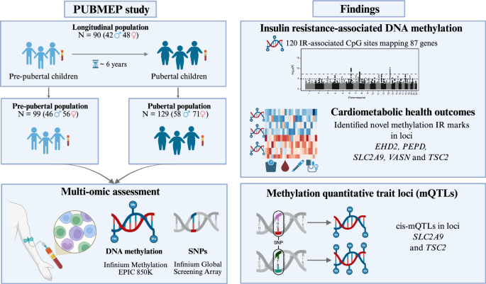
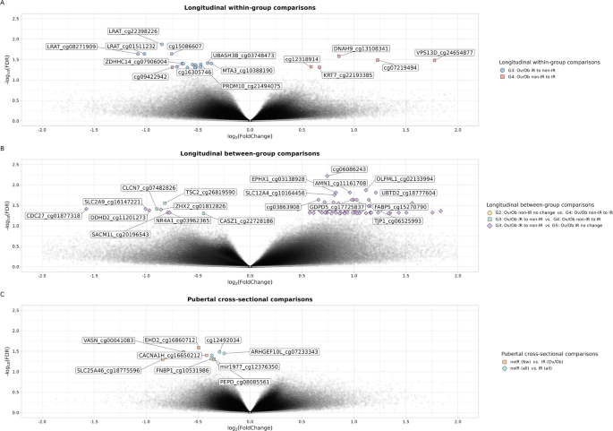
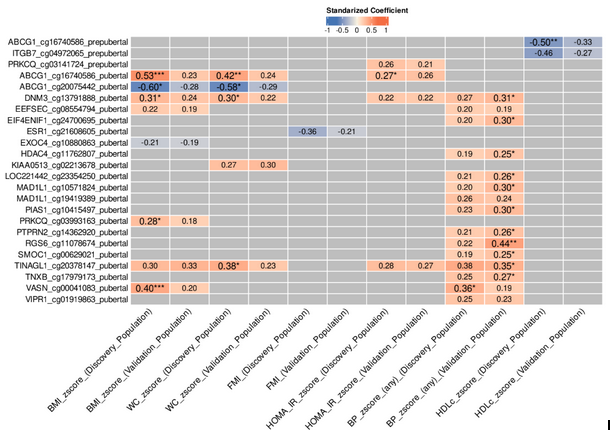
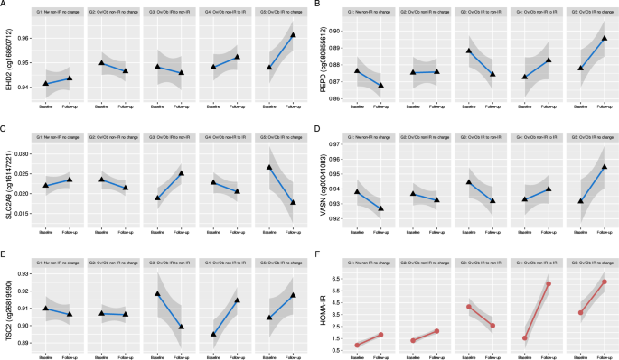

# Novel epigenetic marks of insulin resistance trajectories in a longitudinal study of childhood obesity


## Authors

by Augusto Anguita-Ruiz, Álvaro Torres-Martos, Mireia Bustos-Aibar, Adrià Setó-Llorens, Francisco Javier Ruiz-Ojeda, Luis A. Moreno, Ángel Gil, Mercedes Gil-Campos, Gloria Bueno, Rosaura Leis, Jesús Alcalá-Fdez & Concepción M. Aguilera 


The manuscript is open access, and both the main article and supplementary material can be freely accessed through the following links:

- **Main Article**:
  - **Journal Website**: [https://link.springer.com/article/10.1186/s12933-026-03101-7](https://link.springer.com/article/10.1186/s12933-026-03101-7)
  - **University of Granada Institutional Repository (DIGIBUG)**: [https://digibug.ugr.es/handle/10481/112582](https://digibug.ugr.es/handle/10481/112582)


This open-source repository is shared with the goal of promoting transparency and reproducibility in research, allowing researchers to reproduce the results and adapt the provided pipeline for their own datasets.

## Abstract 

> **Background:** <br> Childhood obesity is a major global public-health challenge. Insulin resistance (IR) is a critical driver of later cardiometabolic alterations. A comprehensive understanding of the molecular mechanisms underlying the initial development of childhood IR is essential for timely prevention and intervention. In this study, we aimed to assess the association between IR and blood DNA methylation in a longitudinal study from childhood into adolescence. 
> <br> **Methods:** <br> The PUBMEP study included a longitudinal core of 90 children with paired blood samples collected at both pre-pubertal and pubertal stages. For cross-sectional analyses, this sample was expanded to 99 pre-pubertal and 129 pubertal participants. IR status was defined according to clinically relevant sex- and pubertal stage specific HOMA-IR cut-offs, as recommended by pediatric expert clinicians. Genotype data was obtained with the Infinium Global Screening Array, and blood DNA methylation sites with the Infinium MethylationEPIC BeadChip. Epigenome-wide associations with IR status and trajectories were tested using linear models in the longitudinal and cross-sectional sets. FDR-adjusted significant CpG sites were assessed with sex- and age-standardised cardiometabolic z-scores (adiposity, lipids, blood pressure, glycaemia and IR) at each stage. mQTL analyses were performed to identify genetic variants that drive IR-associated methylation signals.
> <br> **Results:** <br> We identified 120 CpG sites related to obesity-associated IR in the context of pubertal transition that remained significant after global FDR correction (FDR < 0.05). These CpG sites showed distinct methylation profiles that tracked IR trajectories from prepuberty to puberty, with consistent differences across children whose IR improved, worsened or remained stable, with several of them also related to cardiometabolic traits at pubertal stage, including adiposity measures, blood pressure and glycaemic indices. Among the FDR-significant CpG sites with biological relevance for IR, methylation at CpG sites annotated to *SLC2A9*, *PEPD*, *TSC2*, *EGLN3*, *EHD2* and *VASN* showed consistent associations with pubertal HOMA-IR z-score and, for several loci, with adiposity and blood pressure measures, with methylation changes paralleling IR worsening, improvement or stability across puberty. An mQTL look-up in GoDMC identified 25 cis SNP CpG associations corresponding to 20 of the 120 CpG sites, including CpG sites in *SLC2A9* and *TSC2*, indicating that only a fraction of these IR-associated CpG sites is likely to be partly influenced by nearby genetic variants.
> <br> **Conclusion:** <br> This longitudinal EWAS in children with obesity shows that specific blood DNA methylation signatures mirror IR status and track its evolution across the pubertal transition, with opposing methylation trajectories distinguishing improving from persistent IR. The identification of CpG sites at *VASN*, *SLC2A9*, *PEPD*, *EGLN3*, *EHD2* and *TSC2* links IR trajectories to pathways involved in vascular signalling, urate transport, extracellular matrix remodelling, and hypoxia sensing and nutrient signalling. Complementary mQTL analyses suggest that while some of this epigenetic variation is influenced by local genetic factors, a substantial component is likely acquired in response to metabolic and external exposures. If replicated and functionally characterised, these findings may help refine our understanding of the early molecular architecture of obesity-related IR and inform future strategies for cardiometabolic risk assessment and timing of preventive interventions.


<div align="center">
  
  <p><strong>Figure 1.</strong> Study overview.</p>
</div>

<br> 

<div align="center">
  
  <p><strong>Figure 3.</strong> Multipanel volcano plots illustrating the results of the EWAS analyses (longitudinal within-group, longitudinal between-group, and pubertal cross-sectional comparisons). A Longitudinal within-group comparisons: G3 (Ov/Ob IR Ov/Ob non-IR) and G4 (Ov/Ob non-IR Ov/Ob IR). B Longitudinal between-group comparisons, showing each contrast explicitly: 1) G2 (Ov/Ob non-IR with no change) vs. G4 (Ov/Ob non-IR IR), 2) G3 (Ov/Ob IR non-IR) vs. G4 (Ov/Ob non-IR IR), 3) G3 (Ov/Ob IR non-IR) vs. G5 (Ov/Ob IR with no change)(C) Pubertal cross-sectional comparisons: non-IR (Nw) vs. IR (Ov/Ob); non-IR (Ov/Ob) vs. IR (Ov/Ob); and all non-IR vs. all IR participants. In each plot, the x-axis represents the fold change, and the y-axis shows the of the global FDR. CpG sites surpassing the significance threshold (global FDR < 0.05) are highlighted. For simplification, only the top 10 hypermethylated and top 10 hypomethylated CpG sites meeting the global FDR threshold are labelled with their CpG ID and mapped gene symbol, when available. All analyses were adjusted for age, sex, recruitment centre and white blood cells proportions.</p>
</div>

<br> 

<div align="center">
  
  <p><strong>Figure 4.</strong> Associations between DNAm and continuous cardiometabolic outcomes. The heatmap displays the standardized coefficients representing the associations between DNAm levels at selected CpG sites and various continuous metabolic traits, including BMI z-score, WC z-score, FMI, Glucose z-score, Insulin z-score, HOMA-IR z-score, QUICKI, DBP z-score, SBP z-score, TAG z-score, HDL-c z-score and LDL-c z-score. Only CpG sites exhibiting at least one significant association (FDR < 0.05) are presented. Statistical significance is indicated using asterisks: * (FDR < 0.05), ** (FDR < 0.01). If no asterisk is present but a coefficient is displayed, the association is significant at a nominal p-value < 0.05. Non-significant associations (raw p-value > 0.05) are shown in grey. All analyses were adjusted for age, sex, recruitment centre, and white blood cells proportions.</p>
</div>


<br> 

<div align="center">
  
  <p><strong>Figure 5.</strong> Multipanel longitudinal trajectories of DNAm and HOMA-IR across longitudinal groups. This figure displays the temporal patterns of DNAm (-values) or HOMA-IR at baseline and follow-up, with the x-axis indicating both time points and the y-axis representing either methylation levels for each IR-associated CpG site or HOMA-IR values. Panels A–E illustrate DNAm trajectories for five IR-associated CpG sites: A EHD2 (cg16860712), B PEPD (cg08086561), C SLC2A9 (cg16147221), D VASN (cg00041083), and E TSC2 (cg26819590). Panel F displays the corresponding longitudinal trajectories of HOMA-IR. Faceting by longitudinal groups (G1–G5) enables visualization of methylation and HOMA-IR changes according to obesity and IR trajectories: G1 (Nw non-IR Nw non-IR), G2 (Ov/Ob non-IR Ov/Ob non-IR), G3 (Ov/Ob IR Ov/Ob non-IR), G4 (Ov/Ob non-IR Ov/Ob IR) and G5 (Ov/Ob IR Ov/Ob IR). Across CpG sites, these plots reveal consistent patterns of hypo- or hypermethylation that align with the direction of IR change—improvement, worsening, or stability—mirroring the metabolic transitions reflected by HOMA-IR during puberty.</p>
</div>

## Getting the code 


You can download a copy of all the files in this repository by cloning the [git](https://git-scm.com/) repository:

    git clone https://github.com/AlvaroTorresMartos/EWAS_IR


or [download a zip archive](https://github.com/AlvaroTorresMartos/EWAS_IR/archive/refs/heads/master.zip).


## Dependencies

A `R` environment is required to execute the code. The required libraries for each analysis are specified in each script. 

## License

All source code is made available under a BSD 3-clause license. You can freely use and modify the code, without warranty, so long as you provide attribution to the authors. See `LICENSE.md` for the full license text.

## Citation

If this work or the code provided in this repository has contributed to your research, we kindly ask that you cite our work in your publications. Proper citation helps acknowledge the efforts behind this project and supports further development.

Please use the following citation:

**Anguita-Ruiz, A., Torres-Martos, Á., Bustos-Aibar, M. et al. Novel epigenetic marks of insulin resistance trajectories in a longitudinal study of childhood obesity. Cardiovasc Diabetol 25, 105 (2026). https://doi.org/10.1186/s12933-026-03101-7.**

Alternatively, you can use the following BibTeX entry for your reference manager:

```bibtex
@article{AnguitaRuiz2026,
  title = {Novel epigenetic marks of insulin resistance trajectories in a longitudinal study of childhood obesity},
  volume = {25},
  ISSN = {1475-2840},
  url = {http://dx.doi.org/10.1186/s12933-026-03101-7},
  DOI = {10.1186/s12933-026-03101-7},
  number = {125},
  journal = {Cardiovascular Diabetology},
  publisher = {Springer Science and Business Media LLC},
  author = {Anguita-Ruiz,  Augusto and Torres-Martos,  Álvaro and Bustos-Aibar,  Mireia and Setó-Llorens,  Adrià and Ruiz-Ojeda,  Francisco Javier and Moreno,  Luis A. and Gil,  Ángel and Gil-Campos,  Mercedes and Bueno,  Gloria and Leis,  Rosaura and Alcalá-Fdez,  Jesús and Aguilera,  Concepción M.},
  year = {2026},
  month = feb 
}
```

We deeply appreciate your acknowledgment, as it helps highlight the importance of open science and supports the research community.
